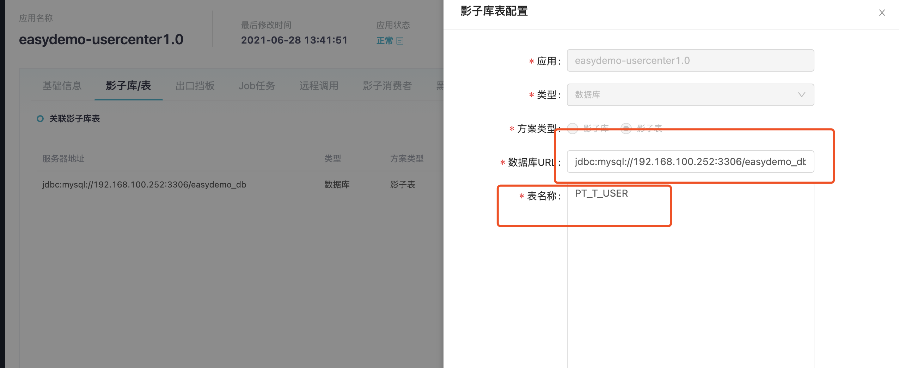
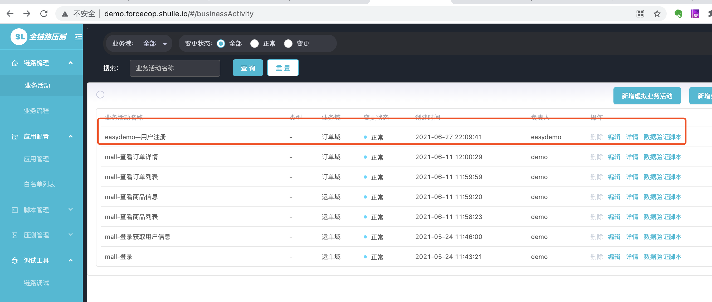
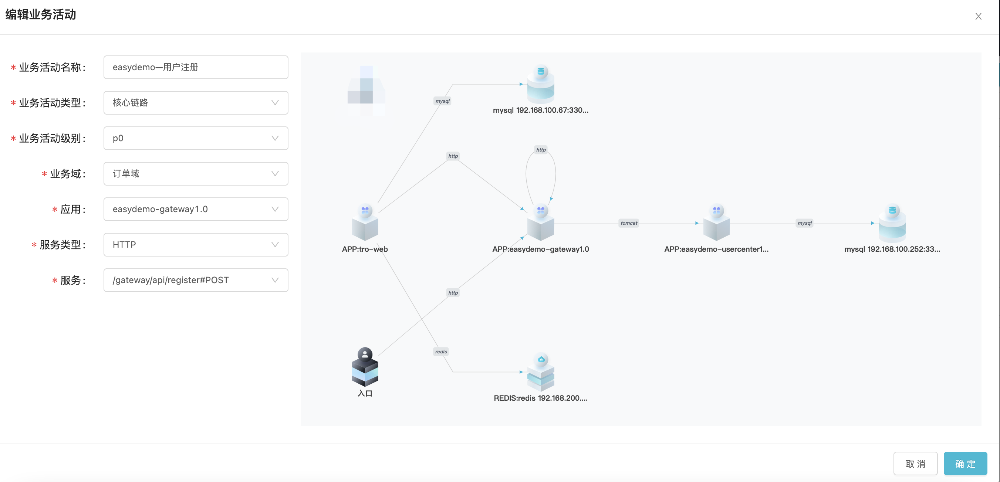
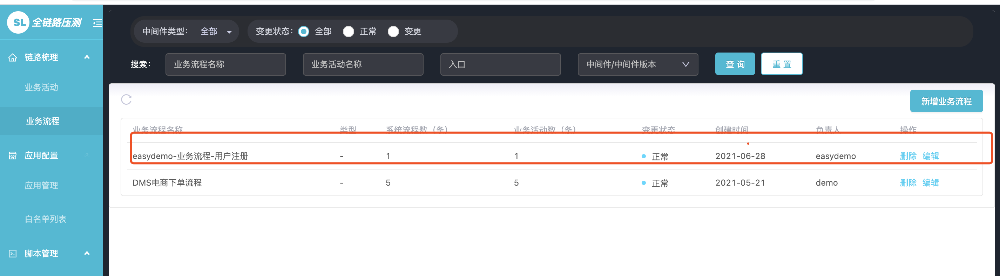
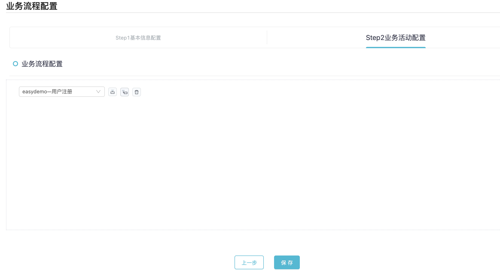

### 准备工作

Takin 控制台--> Easydemo-gateway--> Easydemo-usercenter-> MySQL（真实表、影子表）

CURL --> Easydemo-gateway--> Easydemo-usercenter-> MySQL（真实表、影子表）


### 登录体验机器
（请联系德华 索要 帐号密码）

### 应用目录
    cd /home/takin/easydemo  

#### 执行业务流量到真实表(t_user)    
```
echo 1 | sh curl.sh

{"code":200,"data":"统计业务表数据: 0","error":null}
{"code":200,"data":"统计影子表数据: 0","error":null}
开始发起流量......
流量发完，统计结果
{"code":200,"data":"统计业务表数据: 2","error":null}
{"code":200,"data":"统计影子表数据: 0","error":null}

``` 

### 执行压测流量到影子表(pt_t_user)
``` 
echo 2 | sh curl.sh

{"code":200,"data":"统计业务表数据: 2","error":null}
{"code":200,"data":"统计影子表数据: 0","error":null}
开始发起流量......
流量发完，统计结果
{"code":200,"data":"统计业务表数据: 2","error":null}
{"code":200,"data":"统计影子表数据: 3","error":null}
 
```

### 登录生产压测控制台 Takin
http://demo.forcecop.shulie.io/  

用户名 easydemo 密码easydemo

### 查看应用接入状态 

http://demo.forcecop.shulie.io/#/appManage


#### easydemo-gateway 应用状态
http://demo.forcecop.shulie.io/#/appManage/details?tabKey=0&id=6814481948296089600


主要看一下 远程调用和插件管理的状态

#### easydemo-usercenter应用状态
http://demo.forcecop.shulie.io/#/appManage/details?tabKey=0&id=6814481944844177408


##### easydemo-usercenter影子库/表设置

http://demo.forcecop.shulie.io/#/appManage/details?tabKey=0&id=6814481944844177408




### 业务活动列表
http://demo.forcecop.shulie.io/#/businessActivity




### 编辑业务活动




### 业务流程列表


### 编辑业务流程




### 测试脚本
http://demo.forcecop.shulie.io/#/scriptManage


### 压测场景


### 压测报告


