### Takin 体验（第一关） 

只需要做这几步
1.登录阿里云服务器 ssh takin@47.98.225.139   
2.密码请联系数列科技 客服人员 德华   微信 whitepoplar
3.执行脚本、执行调试信息，确认压测数据落到了影子表  
4.执行压测，查询数据库的信息  

### 调用关系

CURL --> Easydemo-gateway--> Easydemo-usercenter-> MySQL（真实表、影子表）

Takin 控制台（链路调试）--> Easydemo-gateway--> Easydemo-usercenter-> MySQL（真实表、影子表）


### 登录生产压测控制台 Takin
http://demo.forcecop.shulie.io/  

用户名 easydemo 密码easydemo


### 应用目录
    cd /home/takin/easydemo 


### 启动应用 

```
cd ~/easydemo/app/gateway
sh gateway.sh  start

cd ~/easydemo/app/user
sh usercenter.sh start
```

查看各个应用是否有错误日志

```
cd ~/easydemo/
sh log_cnt.sh
```

#### 执行业务流量到真实表(t_user)    
```
echo 1 | sh curl.sh

{"code":200,"data":"统计业务表数据: 0","error":null}
{"code":200,"data":"统计影子表数据: 0","error":null}
开始发起流量......
流量发完，统计结果
{"code":200,"data":"统计业务表数据: 2","error":null}
{"code":200,"data":"统计影子表数据: 0","error":null}

``` 
### 添加业务活动

URL http://demo.forcecop.shulie.io/#/businessActivity

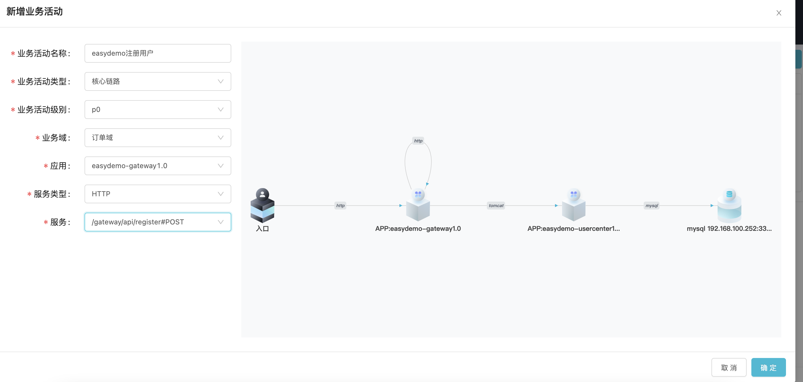

添加成功

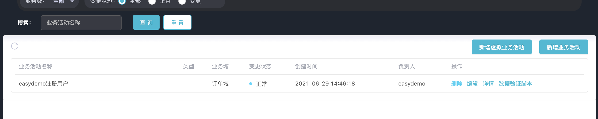

### 添加业务流程

URL http://demo.forcecop.shulie.io/#/businessFlow

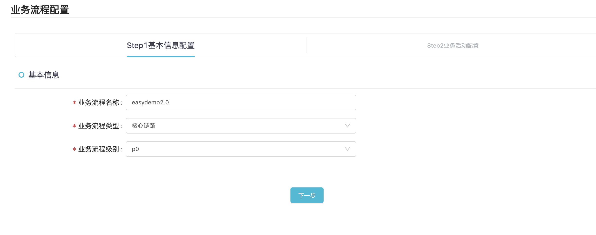
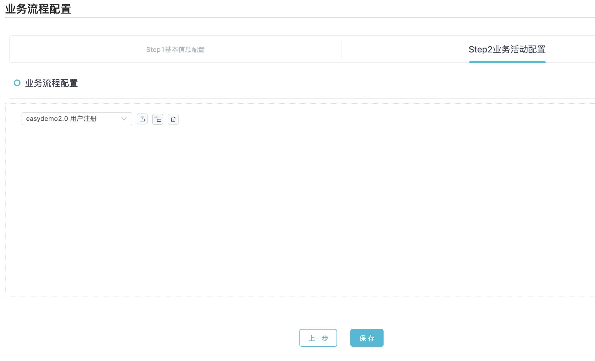

### 应用管理
url http://demo.forcecop.shulie.io/#/appManage

#### gateway应用 ，添加调用白名单

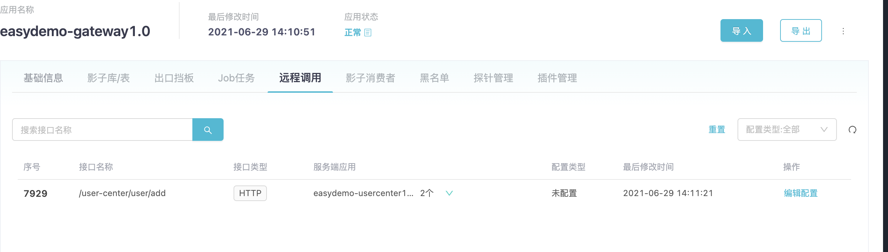
添加白名单
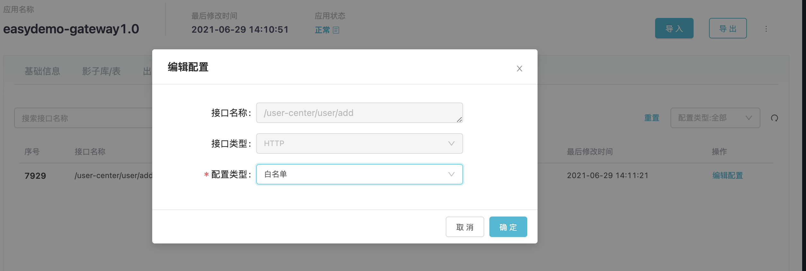

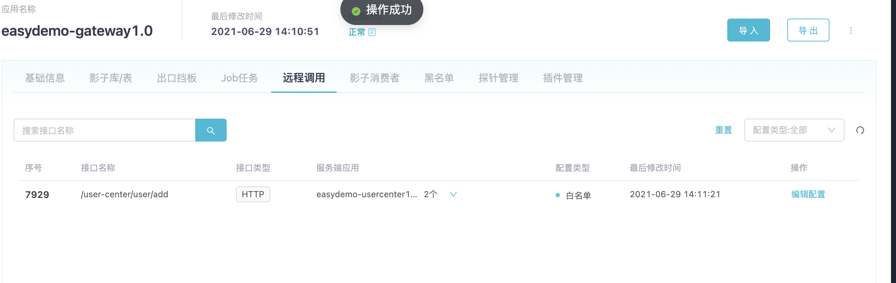


### usercenter应用，添加影子表配置

```
数据源链接：jdbc:mysql://192.168.100.252:3306/easydemo_db
表名：pt_t_user

```

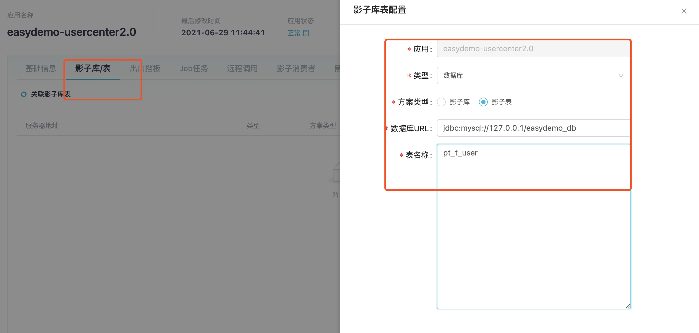


### 执行压测流量到影子表(pt_t_user)
``` 
echo 2 | sh curl.sh

{"code":200,"data":"统计业务表数据: 2","error":null}
{"code":200,"data":"统计影子表数据: 0","error":null}
开始发起流量......
流量发完，统计结果
{"code":200,"data":"统计业务表数据: 2","error":null}
{"code":200,"data":"统计影子表数据: 3","error":null}
 
```

### 查看应用接入状态 

http://demo.forcecop.shulie.io/#/appManage

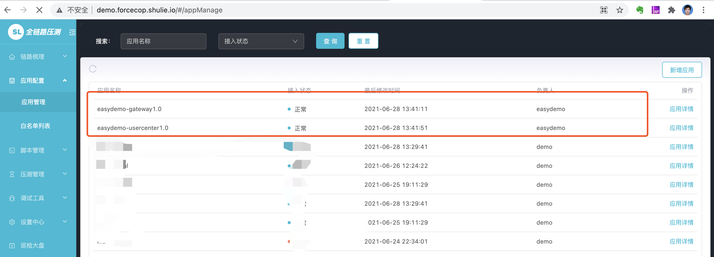


#### easydemo-gateway 应用状态

http://demo.forcecop.shulie.io/#/appManage/details?tabKey=0&id=6814481948296089600

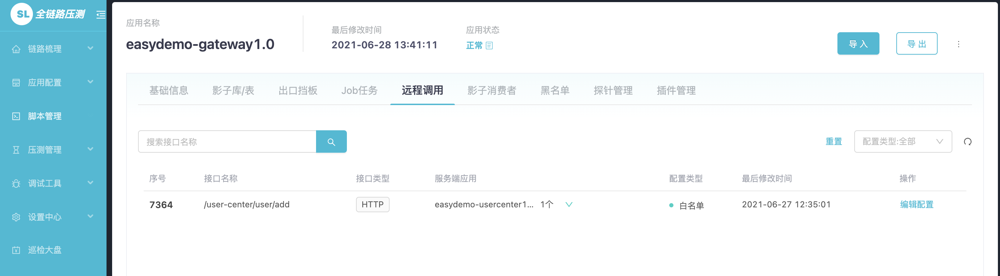


主要看一下 远程调用和插件管理的状态

#### easydemo-usercenter应用状态
http://demo.forcecop.shulie.io/#/appManage/details?tabKey=0&id=6814481944844177408


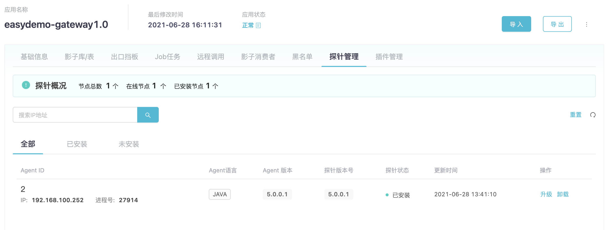


### 压测脚本
http://demo.forcecop.shulie.io/#/scriptManage

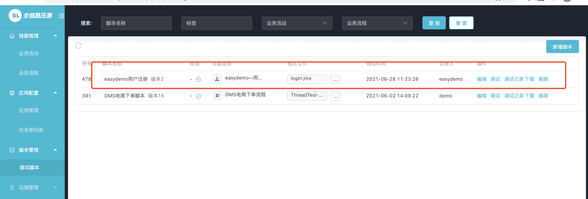

### 压测场景

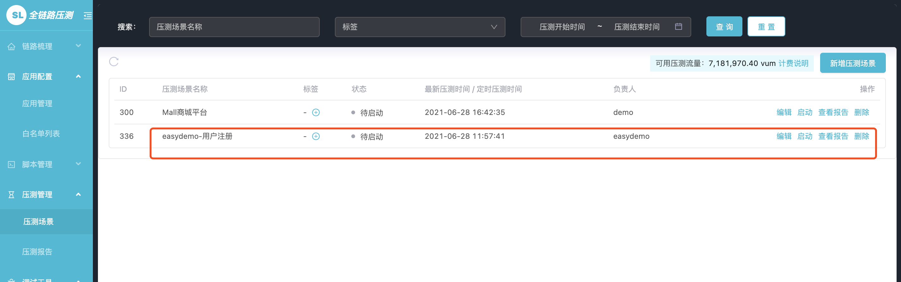

### 压测报告

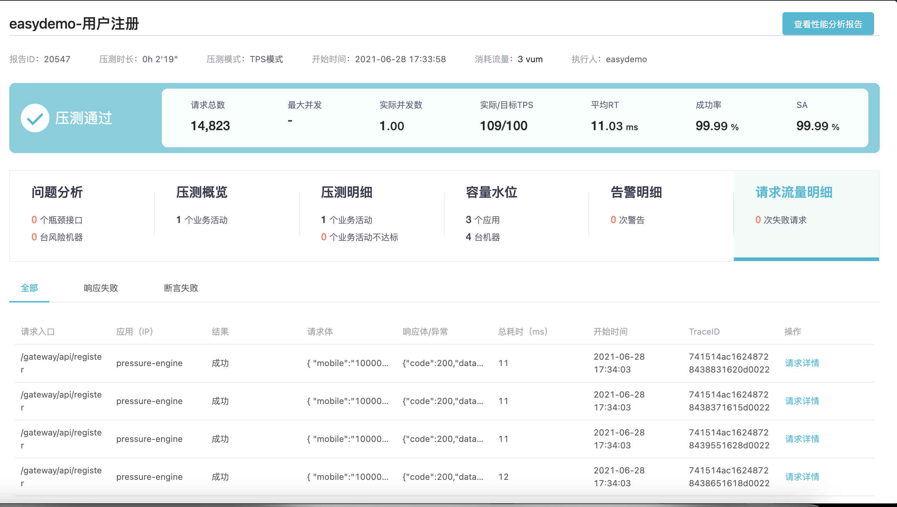


### 查看影子表里面的数据量

```
###查看真实表的数据
mysql -h127.0.0.1 -udemo_db_user -pdemo_db_passwd easydemo_db -P3306 -e"select count(*) from t_user"

###查看影子表的数据

mysql -h127.0.0.1 -udemo_db_user -pdemo_db_passwd easydemo_db -P3306 -e"select count(*) from pt_t_user"

mysql: [Warning] Using a password on the command line interface can be insecure.
+----------+
| count(*) |
+----------+
|    33001 |
+----------+
```
可以在进行压测之前，查看压测数据是否都落入到影子表(pt_t_user)

